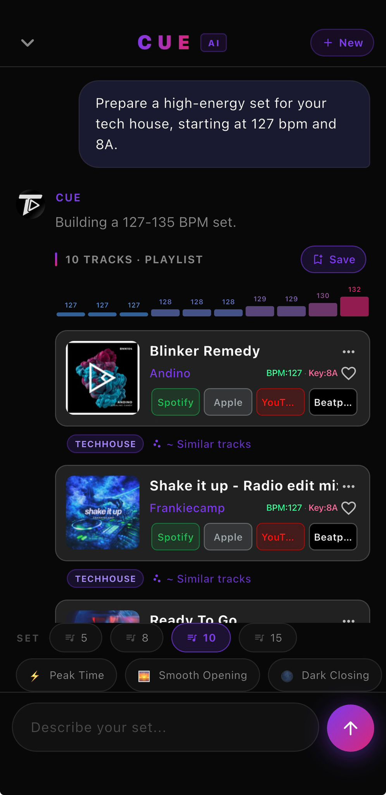
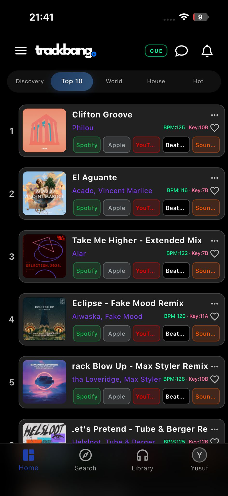
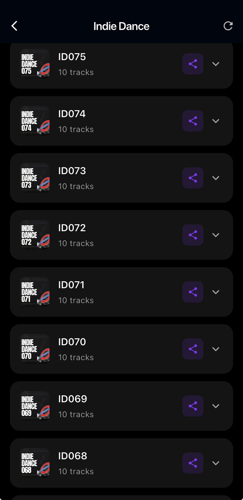
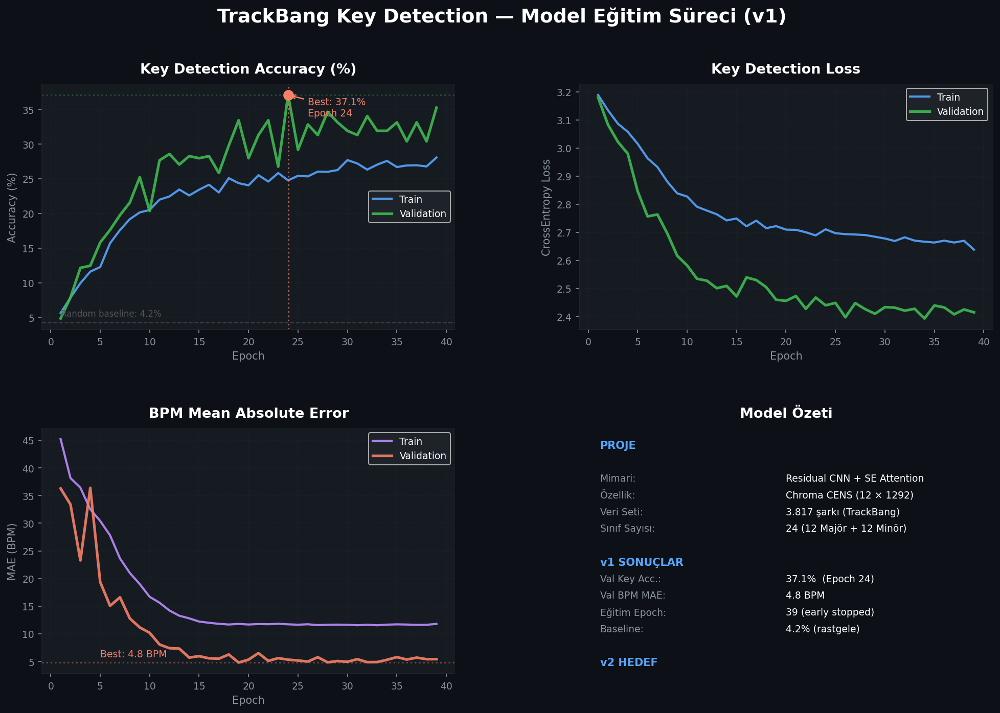

# TrackBang Audio Intelligence
### Musical Key & BPM Detection via Deep Neural Networks

> **Bitirme Projesi / Graduation Project** — Samsun Üniversitesi, Yazılım Mühendisliği  
> **Derin Sinir Ağları Final Projesi** — 2025–2026 Bahar Dönemi  
> **Öğrenci:** Yusuf Kerim Sarıtaş (221118047)  
> **Danışman:** Dr. Öğr. Üyesi Nurettin Şenyer


---

## Demo — Uygulamadan Ekran Görüntüleri

<table>
  <tr>
    <td align="center"><b>CUE AI DJ Asistanı</b><br/><sub>BPM progression + Camelot rozetleri</sub></td>
    <td align="center"><b>Top 10 — BPM & Key</b><br/><sub>Her parçada otomatik BPM ve Key bilgisi</sub></td>
    <td align="center"><b>Küratör Playlists</b><br/><sub>Tür bazlı DJ setleri</sub></td>
  </tr>
  <tr>
    <td></td>
    <td></td>
    <td></td>
  </tr>
</table>

> CUE ekranında görülen **BPM:127 / Key:8A** değerleri ve yükselen enerji barı (127→132 BPM),  
> bu projenin ürettiği verilerle çalışan harmonik sıralama algoritmasının çıktısıdır.

---

## Eğitim Sonuçları (v4 Model — Güncel)



| Metrik | v1 | v4 (Güncel) |
|--------|-----|-------------|
| Val Key Accuracy | %35.3 | **%47.7** |
| Val BPM MAE | ~2.7 BPM | **~1.9 BPM** |
| Epoch | 39 | 75 |
| Parametre | ~2.97M | **858K** |

---

## Proje Özeti

**TrackBang**, iOS ve Android'de yayında olan bir DJ müzik keşif platformudur. Bu proje, TrackBang'e entegre edilmek üzere geliştirilen **yapay zeka destekli ses analiz motorunu** kapsamaktadır.

30 saniyelik bir MP3 önizlemesinden:
- 🎵 **Müzikal Ton (Key)** — 24 sınıf: 12 Majör + 12 Minör (Camelot notasyonuyla)
- 🥁 **BPM** — sürekli regresyon değeri

tahmin eden uçtan uca bir Derin Sinir Ağı sistemi geliştirilmiştir.

---

## 🤝 Hibrit Zeka Metodolojisi

> Bu proje, **insan uzmanlığı** ile **yapay zekanın** birbirini tamamladığı bir hibrit zeka sürecinin ürünüdür.

### İnsan Katkısı (Yusuf Kerim Sarıtaş)

| Alan | Katkı |
|------|-------|
| **Alan Uzmanlığı** | 7+ yıllık DJ deneyimi; Camelot sistemi, harmonik karışım ve BPM enerji eğrisi bilgisi |
| **Problem Tanımı** | Spotify'ın API kapatmasıyla oluşan boşluğun tespit edilmesi ve çözüm mimarisi |
| **Veri Küratörlüğü** | 3.817 parçanın uzman DJ'lerle doğrulanması; etiket kalite kontrolü |
| **Gerçek Dünya Entegrasyonu** | Modelin canlı bir iOS/Android uygulamasına (TrackBang) entegre edilmesi |
| **Değerlendirme** | Müzikal bilgiyle model çıktılarının doğruluğunu insan kulağıyla test etme |

### Yapay Zeka Katkısı (Claude — Anthropic)

| Alan | Katkı |
|------|-------|
| **Mimari Tasarım** | Residual CNN + Squeeze-and-Excitation attention bloklarının önerilmesi |
| **Kod Üretimi** | `model.py`, `feature_extraction.py`, `train.py` iskeletinin oluşturulması |
| **Hata Ayıklama** | Keras 3.x `class_weight` kısıtlamasının `sample_weight`'e dönüştürülmesi |
| **Özellik Mühendisliği** | HPSS + Chroma CENS kombinasyonunun literatürle karşılaştırmalı seçimi |
| **Augmentasyon** | `np.roll` ile pitch-shift augmentasyonunun chroma alanında matematiksel olarak doğru uygulanması |
| **Dashboard** | SSE tabanlı gerçek zamanlı eğitim izleme arayüzü |

### Hibrit Süreç Akışı

```
İnsan (Domain Uzmanı)          Yapay Zeka (Mühendis)
        │                               │
        │  "BPM ve key aynı anda        │
        │   tahmin edilmeli"            │
        │──────────────────────────────▶│
        │                   Multi-output mimari tasarladı
        │◀──────────────────────────────│
        │                               │
        │  "Perküsif sesler             │
        │   key'i bozuyor"             │
        │──────────────────────────────▶│
        │                   HPSS + CENS önerdi
        │◀──────────────────────────────│
        │                               │
        │  "Model production'da         │
        │   çalışmalı"                  │
        │──────────────────────────────▶│
        │                   FastAPI + PM2 deploy pipeline
        │◀──────────────────────────────│
        │                               │
        ▼                               ▼
   3.817 etiketli veri          Çalışan model kodu
   Domain validation            Production deployment
        │                               │
        └───────────┬───────────────────┘
                    ▼
          trackbang.com/analyze
          (Canlı, kullanıma açık)
```

---

## Neden Bu Problem?

DJ'ler 2 saatlik bir set için **3–5 saat** manuel tarama yapar:
- Beatport, SoundCloud, Spotify'da ayrı ayrı parça tarama
- BPM uyumluluğunu zihinsel hesaplama
- Camelot uyumunu elle kontrol etme
- Enerji eğrisini sezgiyle planlama

Kasım 2024'te **Spotify Audio Features API'sini** (BPM, key, energy) kullanımdan kaldırdı. Bu proje, o boşluğu doldurmak için geliştirilmiştir.

---

## Mimari (v4 — Hibrit CNN)

```
MP3 (30 sn)
    │
    ▼
[HPSS — Harmonik/Perküsif Ayrımı]
    │
    ▼
[Chroma CENS — (12 × 1292)]
    │
    ▼
┌──────────────────────────────────────────┐
│     Hibrit Residual CNN + SE Attention   │
│                                          │
│  Conv(64,3×7) → ResBlock(64)+SE          │
│  MaxPool(1×4)                            │
│  ResBlock(128)+SE → MaxPool(1×4)         │
│  ResBlock(256)+SE → MaxPool(1×4)         │
│  ResBlock(256)+SE                        │
│           │                              │
│    ┌──────┴──────┐                       │
│   GAP           GMP   ← paralel dallar  │
│    └──────┬──────┘                       │
│        Concat                            │
│      Dense(256)                          │
│       │        │                         │
│  Key(24,softmax)  BPM(1,linear)          │
└──────────────────────────────────────────┘
    │                  │
    ▼                  ▼
"A Minor / 8A"      123.5 BPM

+ Test-Time Augmentation (TTA): 5 tahmin ortalaması
```

### Squeeze-and-Excitation (SE) Attention

Her Residual bloğundan sonra **kanal bazlı dikkat** mekanizması:

```
Feature Map (B, H, W, C)
    │ GlobalAvgPool
    ▼
(B, 1, 1, C)
    │ Dense(C/8, relu) → Dense(C, sigmoid)
    ▼
Kanal Ağırlıkları
    │ Multiply
    ▼
Weighted Feature Map
```

> "G Majör için G, B, D binleri otomatik olarak ağırlıklanır."

---

## Veri Seti

| Özellik | Değer |
|---------|-------|
| Toplam etiketli örnek | **3.817 şarkı** |
| Kaynak | TrackBang MongoDB + SoundCloud |
| Etiket kalitesi | Uzman DJ'ler tarafından doğrulanmış |
| Ses süresi | 30 saniye / parça |
| Örnekleme frekansı | 22.050 Hz |
| Key sınıfı sayısı | 24 (12 Majör + 12 Minör) |
| BPM aralığı | ~100–175 BPM |
| Format | MP3 (SoundCloud önizleme) |

### Sınıf Dağılımı

```
G Minör    ████████████████ 275
G Majör    ██████████████  245
A Minör    ██████████████  243
F Minör    █████████████   225
F Majör    █████████████   222
...
C# Minör   █████            83
```

---

## Sonuçlar (v4 Model — Güncel)

| Metrik | Değer |
|--------|-------|
| Validation Key Accuracy | **%47.7** (24 sınıf) |
| Validation BPM MAE | **~1.9 BPM** |
| Eğitim epoch sayısı | 75 (early stopping, patience=20) |
| Parametre sayısı | 858.009 |
| Rastgele tahmin baseline | %4.2 |

### Versiyon Karşılaştırması

| Versiyon | Mimari | Val Key Acc | Val BPM MAE |
|----------|--------|-------------|-------------|
| v1 | 3-blok CNN | %35.3 | ~2.7 BPM |
| v2 | Residual + SE | ~%40 | ~2.2 BPM |
| v3 | Dual-branch (başarısız) | — | — |
| **v4** | **Hibrit GAP+GMP + TTA** | **%47.7** | **~1.9 BPM** |

> Rastgele tahmine (%4.2) göre **11× daha iyi** performans.

---

## Özellik Çıkarma Pipeline

### Neden Chroma CENS + HPSS?

| Özellik | Boyut | Key Detection |
|---------|-------|---------------|
| Ham Audio | 660.000 | Çok gürültülü |
| Mel-Spectrogram | 128×1292 | BPM için iyi, key için fazla |
| Chroma CENS | 12×1292 | İyi, gürültüye dayanıklı |
| **Chroma CENS + HPSS** | 12×1292 | **En iyi: sadece harmonik** |

**HPSS (Harmonic-Percussive Source Separation):** Davul ve perküsif sesleri ayırarak yalnızca harmonik bileşenden (akorlar, melodiler) chroma çıkarır. Bu, key tespitinde en kritik iyileştirmedir.

---

## Augmentasyon Stratejisi

| Teknik | Parametre | Açıklama |
|--------|-----------|----------|
| Pitch Shift | ±3 yarım ton | `np.roll(chroma, n, axis=0)` — chroma'da matematiksel olarak TAM doğru |
| Time Masking | 0–100 frame | SpecAugment — kısa sessizliklere dayanıklılık |
| Frequency Masking | 0–3 bin | Eksik nota sınıflarına dayanıklılık |
| Gaussian Gürültü | stddev=0.02 | Kayıt kalitesi farklılıkları |

---

## Kurulum

```bash
# Repoyu klonla
git clone https://github.com/yusuf7855/trackbang-key-detection.git
cd trackbang-key-detection

# Virtual environment oluştur
python3.9 -m venv venv
source venv/bin/activate      # Windows: venv\Scripts\activate

# Bağımlılıkları yükle
pip install -r requirements.txt
```

---

## Kullanım

### Tek Dosya Tahmini

```bash
python src/predict.py muzik.mp3
```

```
Dosya  : muzik.mp3
Analiz ediliyor...

=============================================
  Ton      : A Minor        [8A]
  Güven    : %41.2
  BPM      : 127.4
=============================================
  Alternatifler:
    A Minor        [8A]  ============  %41.2
    E Minor        [9A]  ===           %8.9
    D Minor        [7A]  ==            %6.4
```

### Model Eğitimi

```bash
# İlk kez (cache oluşturur)
python src/train.py --recache --epochs 120 --batch 16

# Tekrar eğitim
python src/train.py --epochs 120 --batch 16 --lr 0.001
```

### REST API

```bash
# API'yi başlat
python src/api.py
# veya
uvicorn src.api:app --reload --port 8000
```

```bash
# Tahmin yap
curl -X POST http://localhost:8000/predict \
  -F "file=@muzik.mp3"
```

```json
{
  "key": "A Minor",
  "camelot": "8A",
  "confidence": 0.412,
  "bpm": 127.4,
  "top3": [
    {"key": "A Minor", "camelot": "8A", "confidence": 0.412},
    {"key": "E Minor", "camelot": "9A", "confidence": 0.089},
    {"key": "D Minor", "camelot": "7A", "confidence": 0.064}
  ]
}
```

Swagger UI: [http://localhost:8000/docs](http://localhost:8000/docs)

---

## Proje Yapısı

```
trackbang-key-detection/
│
├── src/
│   ├── model.py              # Residual CNN + SE Attention + GAP/GMP mimarisi
│   ├── feature_extraction.py # MP3 → HPSS → Chroma CENS → .npy
│   ├── train.py              # Eğitim pipeline (tf.data, augment, class weights)
│   ├── predict.py            # Tek dosya tahmini + TTA
│   ├── api.py                # FastAPI REST endpoint
│   └── build_dataset.py      # MongoDB + SoundCloud veri toplama
│
├── data/
│   ├── raw/previews/         # 30 sn MP3 klipler (2.191 dosya)
│   └── processed/cache/      # Chroma CENS .npy cache (3.817 dosya)
│
├── models/
│   └── key_detection_v4_best.keras  # v4 Hibrit CNN (aktif model)
│
├── results/
│   ├── training_log.csv      # Epoch bazlı metrikler
│   └── plots/                # Eğitim grafikleri
│
├── docs/
│   ├── idea.md               # Proje fikri ve motivasyon
│   ├── proje_metni.md        # Resmi proje metni (öğrenci/danışman bilgisi)
│   ├── WALKTHROUGH.md        # Adım adım proje rehberi
│   └── screenshots/          # Uygulama ekran görüntüleri
│
├── future_work/
│   └── TODO.md               # Gelecek çalışmalar ve açık görevler
│
├── generate_report.py        # Word raporu üretici
├── requirements.txt
├── CHANGELOG.md              # Versiyon geçmişi (v1 → v4)
├── INSTALLATION.md           # Kurulum ve çalıştırma rehberi
├── AGENTS.md                 # Teknik detaylar (AI/geliştirici referansı)
└── README.md
```

---

## Eğitim Hiperparametreleri (v4)

| Parametre | Değer |
|-----------|-------|
| Optimizatör | Adam |
| Öğrenme Hızı | Cosine Decay (0.001 → ~0) |
| Batch Boyutu | 16 |
| Max Epoch | 120 |
| Early Stopping | patience=20 |
| Key Loss | CategoricalCrossentropy (label_smoothing=0.1) |
| BPM Loss | MSE |
| Loss Ağırlıkları | key=1.0, bpm=0.05 |
| Sınıf Ağırlığı | Inverse-frequency |

---

## 🌐 Canlı Deployment

Bu proje yalnızca akademik bir çalışma değil — **production'da aktif olarak çalışmaktadır.**

| Bileşen | URL / Detay |
|---------|------------|
| **Web Uygulaması** | [trackbang.com/analyze](https://trackbang.com/analyze) |
| **iOS Uygulaması** | [App Store — TrackBang](https://apps.apple.com/app/trackbang/id6738064710) |
| **Android Uygulaması** | [Google Play — TrackBang](https://play.google.com/store/apps/details?id=com.trackbang.app) |
| **Backend API** | `POST https://api.trackbangserver.com/api/analyze/upload` |
| **Model Sunucu** | FastAPI + Uvicorn, PM2 ile yönetilen (72.62.63.184) |

> Herhangi bir kullanıcı giriş yapmadan [trackbang.com/analyze](https://trackbang.com/analyze) adresinden MP3 yükleyerek bu modeli test edebilir.

---

## TrackBang Ekosistemi

Bu model, TrackBang platformunun **CUE AI DJ Asistanı** ile entegre çalışmaktadır:

```
Kullanıcı: "8A tonunda karanlık peaktime"
           │
           ▼
    [CUE AI — Groq LLM]
    intent: music
    camelot: "8A"
    mood: "dark"
    timeOfNight: "peaktime"
           │
           ▼
    [TrackBang MongoDB]
    BPM & Key: bu model tarafından etiketlenmiş
           │
           ▼
    Harmonik olarak uyumlu parça listesi
```

---

## Geliştirici

**Yusuf Kerim Sarıtaş**  
Yazılım Mühendisliği, Samsun Üniversitesi  
TrackBang Kurucu  
GitHub: [@yusuf7855](https://github.com/yusuf7855)

---

## Lisans

MIT License — Akademik ve eğitim amaçlı kullanım serbesttir.
